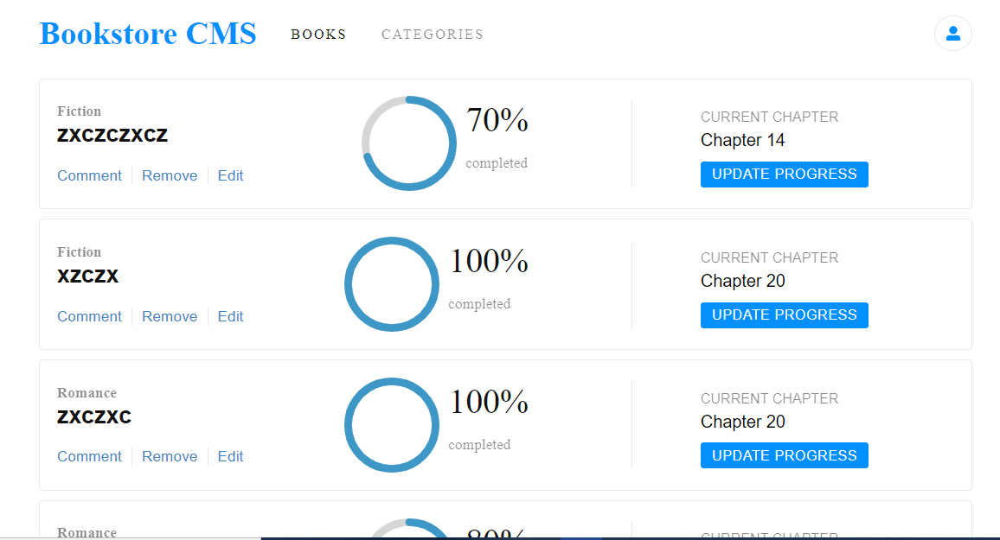

## Bookstore
The Bookstore is a website similar to the "Awesome Books" website built in the previous module. An MVP version of it is created that allows users to:
- Display a list of books.
- Add a book.
- Remove a selected book.



## Built With

- React
- Redux
- Github

## Live Link

[Live Link](coming soon)

### Setup
~~~ 
git clone git@github.com:smart1-hub/bookstore.git
cd bookstore

~~~
- install project dependencies
```
npm install
```
- start project
```
npm start
```

## Environment Prerequisites

Web Browser

Code editor: Vscode or any other code editor

## Author

👤 **Ademola Adebayo**

- Github: [@Ademola](https://github.com/Smart1-hub)

- Twitter: [@ademola_adebayo](https://twitter.com/ademola_adebayo)

- LinkedIn: [Ademola Adebayo](https://www.linkedin.com/in/ademola-adebayo-81051578/)


## Acknowledgement

- Microvers Org.

## Contributing

Contributions, issues, and feature requests are welcome!

## Show your support

Give a ⭐ if you like this project and how it is built!


## 📝 License

This project is [MIT](https://github.com/microverseinc/readme-template/blob/master/MIT.md) licensed.